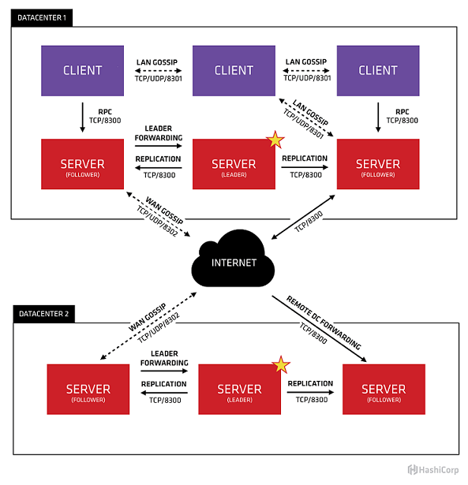

[TOC]

# 服务发现基本原理　　

## 初识服务发现

### 1) 什么是服务发现？　　
服务发现组件记录了（大规模）分布式系统中所有服务的信息，人们或者其它服务可以据此找到这些服务。 DNS 就是一个简单的例子。当然，复杂系统的服务发现组件要提供更多的功能，例如，服务元数据存储、健康监控、多种查询和实时更新等。
不同的使用情境，服务发现的含义也不同。例如，网络设备发现、零配置网络（ rendezvous ）发现和 SOA 发现等。**无论是哪一种使用情境，服务发现提供了一种协调机制，方便服务的发布和查找。**　　　　

### 2）服务发现应该具备哪些关键特性，理由是什么？  
服务发现是支撑大规模 SOA 的核心服务，它必须是高可用的，**提供注册、目录和查找**三大关键特性，仅仅提供服务目录是不够的。前文已经提到过，服务元数据存储是服务发现的关键，因为复杂的服务提供了多种服务接口和端口，部署环境也比较复杂。一旦服务发现组件存储了大量元数据，它就必须提供强大的查询功能，包括服务健康和其它状态的查询。    

### 3）你认为服务发现带来的主要好处是什么？  
服务发现的主要好处是**「零配置」**：不用使用硬编码的网络地址，只需服务的名字（有时甚至连名字都不用）就能使用服务。在现代的体系架构中，单个服务实例的启动和销毁很常见，所以应该做到：无需了解整个架构的部署拓扑，就能找到这个实例。
服务发现组件必须提供查询所有服务的部署状态和集中控制所有服务实例的手段。对于那些不仅提供 DNS 功能的复杂系统，这一点尤为关键。

### 4）时至今日，哪一种服务发现解决方案是最可靠的？
目前，业界提供了很多种服务发现解决方案。    
人们已经使用 DNS 很长时间了， DNS 可能是现有的最大的服务发现系统。小规模系统可以先使用 DNS 作为服务发现手段。一旦服务节点的启动和销毁变得更加动态， DNS 就有问题了，因为 DNS 记录传播的速度可能跟不上服务节点变化的速度。  
ZooKeeper 大概是最成熟的配置存储方案，它的历史比较长，提供了包括配置管理、领导人选举和分布式锁在内的完整解决方案。因此， ZooKeeper 是非常有竞争力的通用的服务发现解决方案，当然，它也显得过于复杂。  
etcd 和 doozerd 是新近出现的服务发现解决方案，它们与 ZooKeeper 具有相似的架构和功能，因此可与 ZooKeeper 互换使用。  
Consul 是一种更新的服务发现解决方案。除了服务发现，它还提供了配置管理和一种键值存储。 Consul 提供了服务节点的健康检查功能，支持使用 DNS SRV 查找服务，这大大增强了它与其它系统的互操作性。 Consul 与 ZooKeeper 的主要区别是： Consul 提供了 DNS 和 HTTP 两种 API ，而 ZooKeeper 只支持专门客户端的访问。  
如果你希望实现一个 AP( Availability and Partition ) 系统， Eureka 是一个很好的选择，并在 Netflix 得到了实战的检验。在出现网络分区时， Eureka 选择可用性，而不是一致性。  

### 5）实施服务发现面临的最大挑战是什么？  
服务发现之复杂，远超一般人的想象。这种复杂性源自分布式系统的复杂性。  
一开始，你可以用一个配置文件实现服务发现，这个文件中包含了所有服务的名字、 IP 地址和端口等信息。当系统变得更加动态后，你就要把服务发现从静态配置迁移到一个真正的解决方案。这个迁移过程，并不像一般人所想的那么容易。最大的一项挑战是无从知晓所选的服务发现系统的侵入性如何：一旦选定一个服务发现系统，就很难再改用其它的服务发现系统，因此，一开始就必须选择正确的解决方案。    
很多服务发现系统都实现了某种形式的分布式共识算法，保证即使有节点失效系统仍然能够正常运转。但是，这些算法是出名地难实现，关键是要识别出分布式系统中失效的节点，这很困难。如果不能正确地识别，就不会正确地实现分布式共识算法。  

## 了解Eureka

### 1) 什么是Eureka？
Eureka是Netflix开源的用于负载均衡和中间层服务器的故障转移的开源工具，其功能是基于RESTful来实现的。

### 2）Eureka 的适用场景   
* AWS 的环境下有一个中间层服务，但不想将其注册到 ELB，或者不想将其暴露给外部世界  
* 不需要 session 绑定机制，没有粘性会话和在外部缓存(例如 memcached)载入会话数据的需要  
* 自己实现 LB 算法  

### 3）Eureka 体系架构  
Eureka的架构图如下所示  
   
从图中我们可以看出，Eureka 组件分为两部分：Eureka 服务器和 Eureka 客户端。而客户端又分为 Application Service 客户端和 Application Client 客户端两种。
其中，Eureka服务器用作服务注册服务器。Eureka客户端是一个java客户端，用来简化与服务器的交互、作为轮询负载均衡器，并提供服务的故障切换支持。Netflix在其生产环境中使用的是另外的客户端，它提供基于流量、资源利用率以及出错状态的加权负载均衡。    
  
### 4） Eureka 的工作机制  
每个 region 都有自己的 Eureka 服务器集群，每个 zone 至少要有一个 Eureka 服务器以应对 zone 瘫痪。      
Application Service 在启动时注册到 Eureka 服务器，之后每 30 秒钟发送心跳以更新自身状态。如果该客户端没能发送心跳更新，它将在 90 秒之后被其注册的 Eureka 服务器剔除。来自任意 zone 的 Application Client 可以查看这些注册信息(每隔 30 秒查看一次)并依此定位自己的侍服 Application Service 实例，进而进行远程调用。    

## 了解Consul

### 1） 什么是Consul  
Consul 是一个支持多数据中心分布式高可用的服务发现和配置共享的服务软件，由 HashiCorp 公司用 Go 语言开发，基于 Mozilla Public License 2.0 的协议进行开源。Consul 支持健康检查，并允许 HTTP 和 DNS 协议调用 API 存储键值对。
命令行超级好用的虚拟机管理软件 vgrant 也是 HashiCorp 公司开发的产品。  
一致性协议采用 Raft 算法，用来保证服务的高可用，使用 GOSSIP 协议管理成员和广播消息, 并且支持 ACL 访问控制。 

### 2） Consul 的适用场景  
* docker 实例的注册与配置共享  
* coreos 实例的注册与配置共享  
* vitess 集群  
* SaaS 应用的配置共享  
* 与 confd 服务集成，动态生成 nginx 和 haproxy 配置文件  

### 3） Consul 的优势  
* 使用 Raft 算法来保证一致性, 比复杂的 Paxos 算法更直接. 相比较而言, zookeeper 采用的是 Paxos, 而 etcd 使用的则是 Raft。  
* 支持多数据中心，内外网的服务采用不同的端口进行监听。 多数据中心集群可以避免单数据中心的单点故障,而其部署则需要考虑网络延迟, 分片等情况等. zookeeper 和 etcd 均不提供多数据中心功能的支持。    
* 支持健康检查。 etcd 不提供此功能。  
* 支持 http 和 dns 协议接口. zookeeper 的集成较为复杂, etcd 只支持 http 协议。    
* 官方提供web管理界面, etcd 无此功能。  

### 4） Consul 的体系架构  
Consul的架构图如下所示  

Agent - 运行在consul集群的每个node上的daemon，agent可以run在server或者是client上，每个agent都可以提供DNS或者是HTTP的接口，负责health check和service发现等。  
Client - client把所有的RPCs转发到server端，是相对无状态的。唯一在后台运行的时client端执行了LAN gossip pool，只消耗极少的资源和网络带宽。  
Server - server 负责维护cluster state， RPC quiries， 和其他数据中心交换WAN gossip，转发queries给leader或者其他数据中心。   
Datacenter - Datacenter是一种网络环境，具有私有，低延迟，高带宽等特征，排除和公网的通信。这里面还包含逻辑功能的划分，不同的server或client可以构成不同的datacenter。    
Serf - consul是基于Serf上实现的，Serf是一个服务发现，编配（应用集群管理等）工具，它去中心化，高可用并且能故障恢复（容忍), Serf使用Gossip协议，采用Go语言编写。Serf提供成员关系，纠错检查，广播的功能。gossip包含的任意node-to-node间的通信，主要是基于UDP。  
LAN Gossip - 指 LAN gossip pool 包含那些都在同一局域网或者是datacenter的node。    
WAN Gossip - 指 WAN gossip pool 包含那些都在同一局域网或者是datacenter的node。    
RPC - Remote Procedure Call. 客户端和服务器端的请求/应答机制。  
