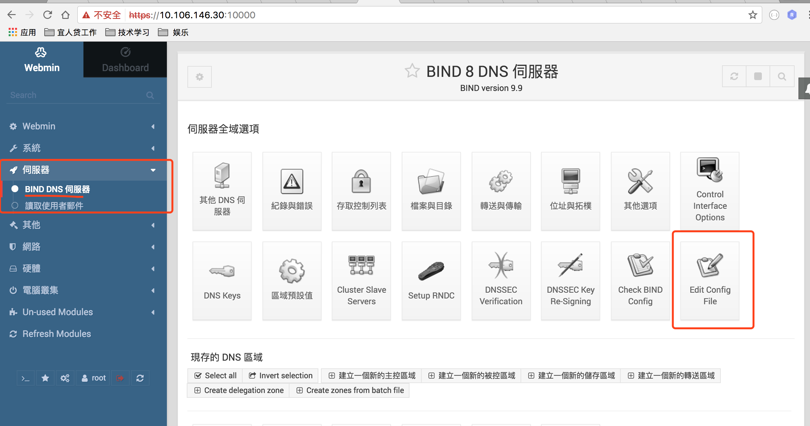

# 使用docker搭建dns server

## 本文引用自http://www.damagehead.com/blog/2015/04/28/deploying-a-dns-server-using-docker/

### docker-compose.yaml

        version: '2.1'
        services:
          bind:
            image: sameersbn/bind:latest
            dns: 127.0.0.1
            environment:
              - ROOT_PASSWORD=SecretPassword
            ports:
              - 10000:10000
              - 53:53/udp
            volumes:
              - /srv/docker/bind:/data

## 操作

1. 访问https://ip:1000 进入webmin管理页面，用root/SecretPassword登录
2. [可以使用图形界面话工具按步骤配置](http://www.chinastor.org/FuWuQi/9506.html)
3. 也可以直接修改配置文件,如下图所示。
  
  