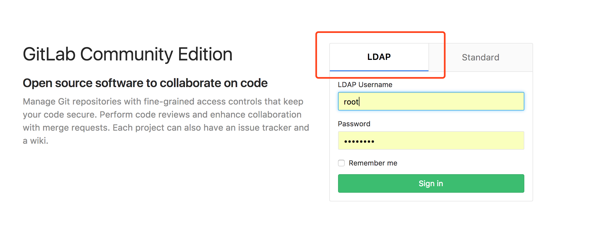

# gitlab 配置 ldap

1. 查看docker容器ID
    
        [root@gitlab-server-60 gitlab]# docker ps
        CONTAINER ID        IMAGE                                                COMMAND                  CREATED             STATUS              PORTS                                                NAMES
        c4f4fd5468c8        registry.docker.yixinonline.org/gitlab:8.16.4-ce.0   "/app/gitlab/entry..."   6 days ago          Up 13 minutes       0.0.0.0:80->80/tcp, 443/tcp, 0.0.0.0:20022->22/tcp   gitlab.internal
  
2. 进入容器

        [root@gitlab-server-60 gitlab]# docker exec -it c4f /bin/bash
        root@gitlab:/# 
      
3. 修改配置

        root@gitlab:/# vi /etc/gitlab/gitlab.rb 

    **注意该路径现在已经挂在出来了，直接进行修改TODO即可**    

4. 打开ldap配置部分修改配置如下

        gitlab_rails['ldap_enabled'] = true
    
        ###! **remember to close this block with 'EOS' below**
        ###! **remember to close this block with 'EOS' below**
        gitlab_rails['ldap_servers'] = YAML.load <<-'EOS'
           main: # 'main' is the GitLab 'provider ID' of this LDAP server
             label: 'LDAP'
             host: 'ldap.internal'
             port: 389
             uid: 'cn'
             method: 'plain' # "tls" or "ssl" or "plain"
             bind_dn: 'cn=admin,dc=internal'
             password: 'admin_pass'
             active_directory: true
             allow_username_or_email_login: false
             block_auto_created_users: false
             base: 'cn=developer,ou=oss,dc=internal'
             user_filter: ''
             attributes:
               username: ['uid', 'userid', 'sAMAccountName']
               email:    ['mail', 'email', 'userPrincipalName']
               name:       'cn'
               first_name: 'givenName'
               last_name:  'sn'
        #     ## EE only
        #     group_base: ''
        #     admin_group: ''
        #     sync_ssh_keys: false
        #
        #   secondary: # 'secondary' is the GitLab 'provider ID' of second LDAP server
        #     label: 'LDAP'
        #     host: '_your_ldap_server'
        #     port: 389
        #     uid: 'sAMAccountName'
        #     method: 'plain' # "tls" or "ssl" or "plain"
        #     bind_dn: '_the_full_dn_of_the_user_you_will_bind_with'
        #     password: '_the_password_of_the_bind_user'
        #     active_directory: true
        #     allow_username_or_email_login: false
        #     block_auto_created_users: false
        #     base: ''
        #     user_filter: ''
        #     attributes:
        #       username: ['uid', 'userid', 'sAMAccountName']
        #       email:    ['mail', 'email', 'userPrincipalName']
        #       name:       'cn'
        #       first_name: 'givenName'
        #       last_name:  'sn'
        #     ## EE only
        #     group_base: ''
        #     admin_group: ''
        #     sync_ssh_keys: false
        EOS

5. 退出容器 重启gitlab

        root@gitlab:/# exit
        exit
        [root@gitlab-server-60 gitlab]# docker-compose restart

6. 访问gitlb验证

      
 
7. 用户注册可以用admin账户登陆后取消用户注册功能 