# 基于rancher搭建k8s图解

1 rancher-server启动后访问8080端口效果如下

  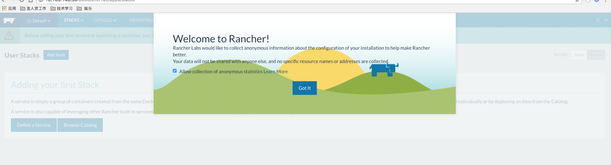

2 进入 Management Environments

  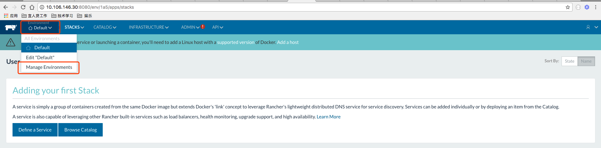

3 点击 add Environment 
  
  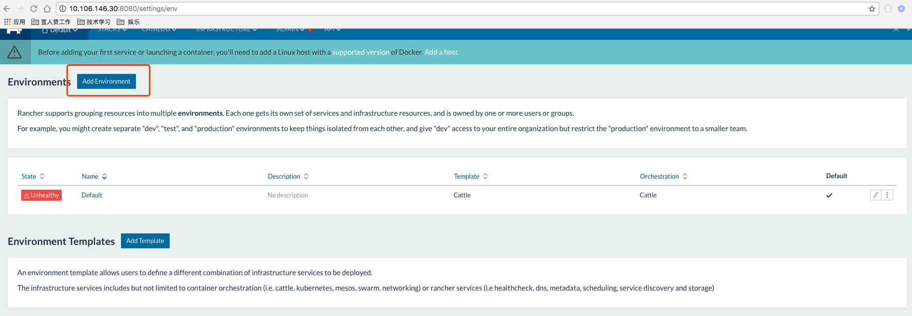

4 填写相关内容 点击创建   
  
  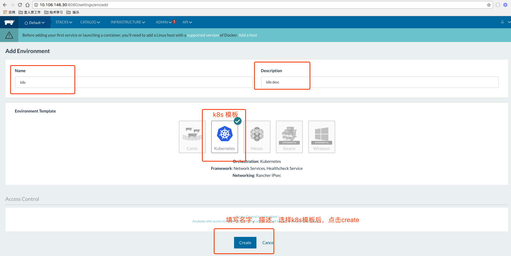

5 将k8s设置成默认环境，并将default环境删除(非必须)  
  
  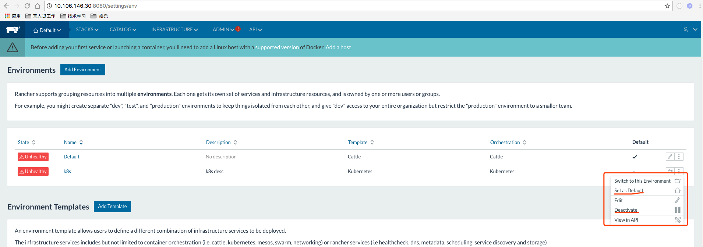
  
6 k8s环境设置成功
  
  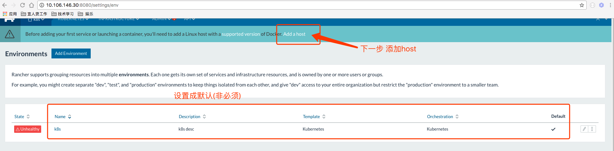
  
7 添加HOST，先设置访问地址
  
  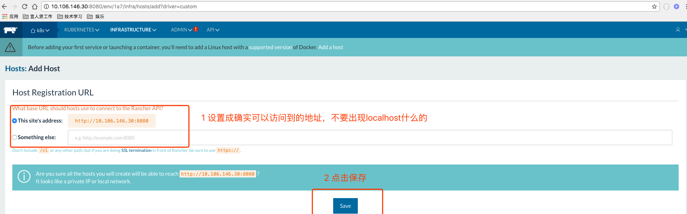

8 添加HOST 
  
  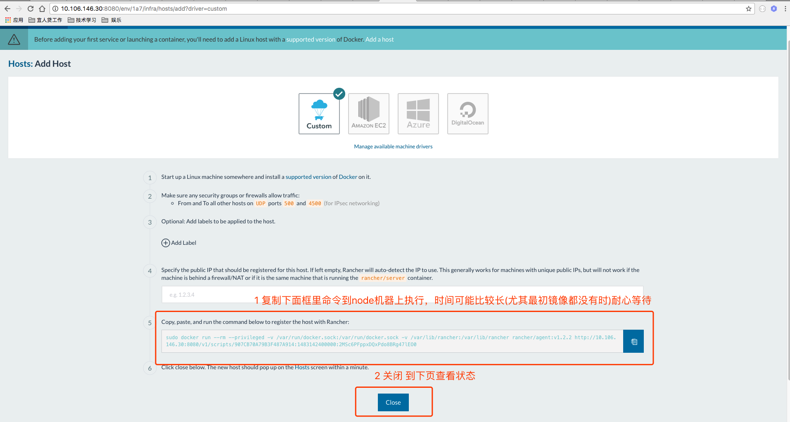
  
9 等待k8s环境安装完毕  
  
  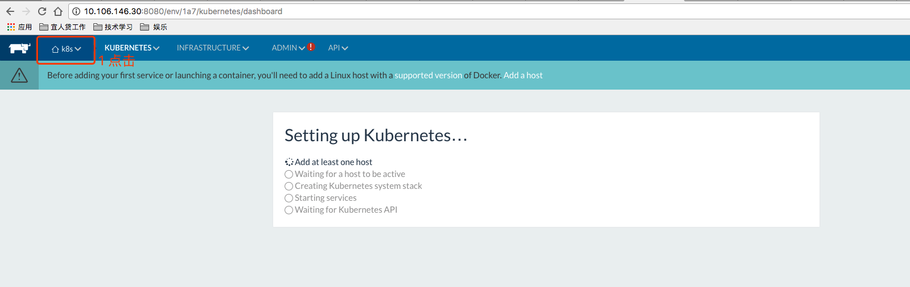
  
10 完成后  
  
  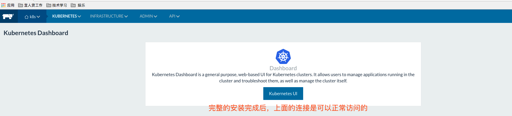

11 kubernetes ui 界面，可进行很多基本的图形化操作  
  
  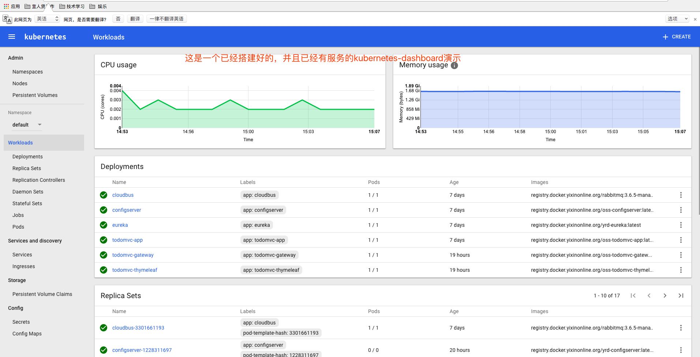

12 kubectl 命令相关 
  
  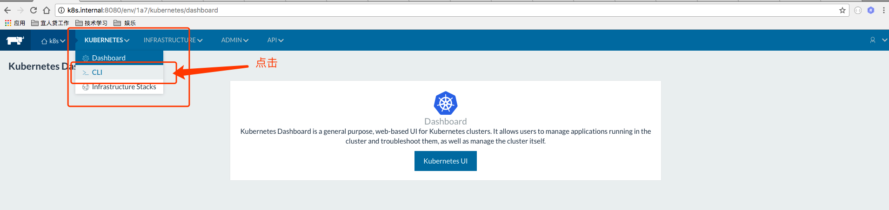

13 kubectl 命令，可直接在页面上敲命令，但是最方便的还是copy配置设置完成后，在shell中敲  
  
  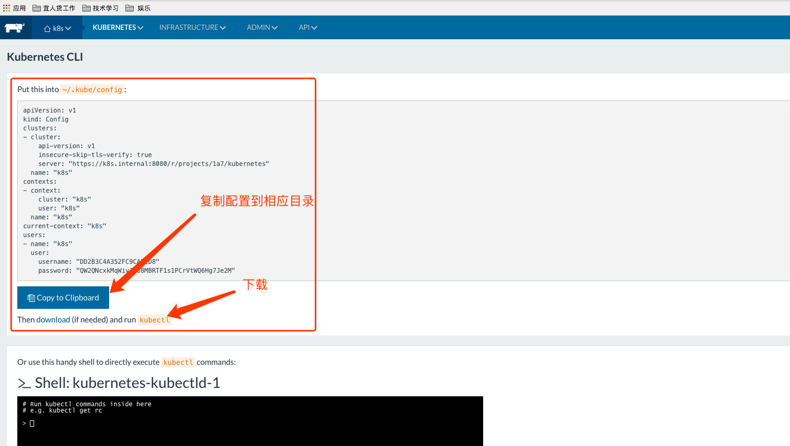
  
14 若k8s搭建有问题，比如说kubernetes ui 不能访问，那么最有可能是下图中的namespace没有，而且大部分情况是不能翻墙导致的，请设置自己的环境能够翻墙
  
  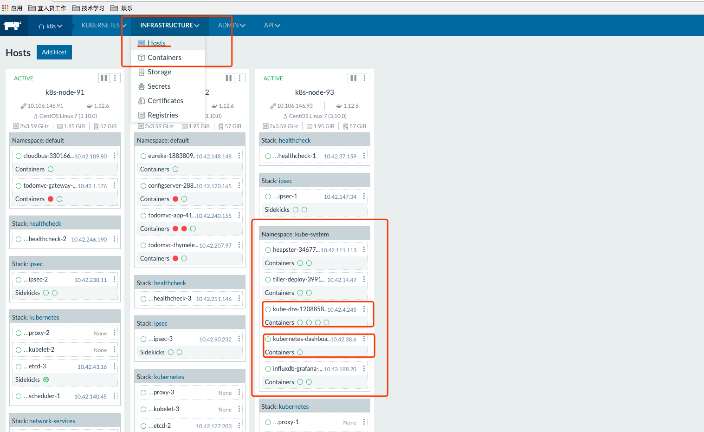